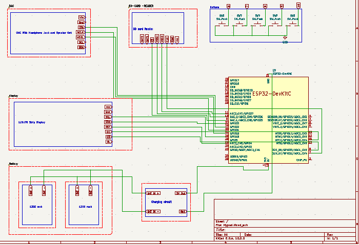
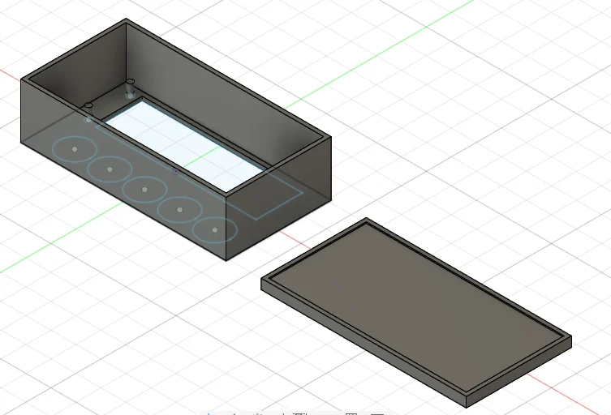
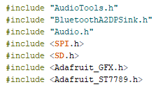

# MYPODS 
MYPODS is a handheld Music Player , which u can listen music via Bluetooth or play from SD card and control Songs , listen music via headphone jack , Also Get songs meta data on the display .

# Connection schematic

# 3D Model

# Library Used 

 AudioTools - It transfer Audio smoothly from one place to another.
 BluetoothA2DPSink - It makes ESP32 as High-Quality Audio Receiver.
 Audio - It is like a music player software.         
 SPI - SPI communication Highway
 SD - The File Eplorer
 Adafruit_GFX -  Adafruit art studio
 Adafruit_ST7789 - The screen Translator

